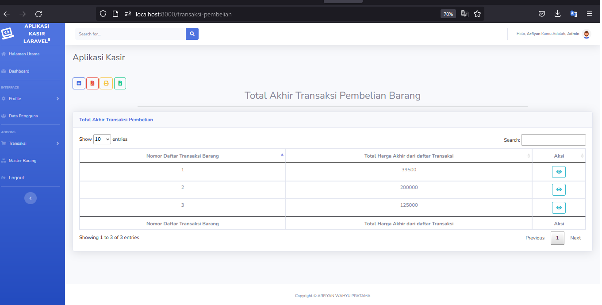

Nama : ARFIYAN

aplikasi kasir sederhana yang mencakup fitur:

1. Mencatat transaksi pembelian barang
2. Menampilkan daftar transaksi pembelian barang
3. Authentikasi login pengguna
4. Pengaturan data pengguna
5. Pengaturan data master produk

## Cara Instalasi ke Server Lokal :

-   Follow Github Saya
-   Star Repo Github Saya
-   Fork Repo Github Saya
-   clone project repo saya
-   lalu masuk ke direktori repo
-   lalu ketik composser install dan php artisan key generate (jangan lupa salin dan setting file env)
-   migrate database pada terminal/cmd/git bash
-   jalankan php artisan db:seed pada terminal/cmd/git bash

Notes : Jika Sudah Menjalankan db:seed (Seeder Laravel) yang berfungsi untuk membuatkan data secara otomatis pada database untuk password akun nya adalah :

<b>Akun Admin :</b>

<ul>
<li>email : arfiyan@gmail.com</li>
<li>password : Amano2829</li>
</ul>

<b>Akun Kasir :</b>

<ul>
<li>email : dara@gmail.com</li>
<li>password : Amano2829</li>
</ul>

<ul>
<li>email : amalia@gmail.com</li>
<li>password : Amano2829</li>
</ul>

## Fitur Role Atau Pembatasan Menu Untuk Setiap Users

-   Admin
-   Kasir

## Fitur Aplikasi

-   Login 
-   Register 
-   Logout 
-   Halaman Utama  

    A. Profile 

-   Ubah Data (Data Profile) 
-   Detail Data (Data Profile)  

    B. Data Pengguna 

-   Tambah Data (Data Pengguna) 
-   Ubah Data (Data Pengguna) 
-   Hapus Data (Data Pengguna) 
-   Detail Data (Data Pengguna) 
-   Cari Data (Data Pengguna) 
-   Print Data (Data Pengguna) 
-   PDF Data (Data Pengguna) 
-   Print Data Detail (Data Pengguna) 
-   PDF Data Detail (Data Pengguna) 
-   Excel Export Data (Data Pengguna)  

    C. Master Barang 

-   Tambah Data (Master Barang) 
-   Ubah Data (Master Barang) 
-   Hapus Data (Master Barang) 
-   Detail Data (Master Barang) 
-   Cari Data (Master Barang) 
-   Print Data (Master Barang) 
-   PDF Data (Master Barang) 
-   Print Data Detail (Master Barang) 
-   PDF Data Detail (Master Barang) 
-   Excel Export Data (Master Barang)  

    C. Transaksi Pembelian 

-   Tambah Data (Transaksi Pembelian) 
-   Ubah Data (Transaksi Pembelian) 
-   Hapus Data (Transaksi Pembelian) 
-   Detail Data (Transaksi Pembelian) 
-   Cari Data (Transaksi Pembelian) 
-   Print Data (Transaksi Pembelian) 
-   PDF Data (Transaksi Pembelian) 
-   Print Data Detail (Transaksi Pembelian) 
-   PDF Data Detail (Transaksi Pembelian) 
-   Excel Export Data (Transaksi Pembelian)  

    C. Transaksi Pembelian Barang 

-   Tambah Data (Transaksi Pembelian Barang) 
-   Ubah Data (Transaksi Pembelian Barang) 
-   Hapus Data (Transaksi Pembelian Barang) 
-   Detail Data (Transaksi Pembelian Barang) 
-   Cari Data (Transaksi Pembelian Barang) 
-   Print Data (Transaksi Pembelian Barang) 
-   PDF Data (Transaksi Pembelian Barang) 
-   Print Data Detail (Transaksi Pembelian Barang) 
-   PDF Data Detail (Transaksi Pembelian Barang) 
-   Excel Export Data (Transaksi Pembelian Barang)  

## Aplikasi Screenshot

<b>Halaman Home</b>
  
<b>Halaman Dashboard</b>
  
<b>Data Barang</b>
  
<b>Data Pengguna</b>
  
<b>Daftar Transaksi Pembelian Barang</b>
  
<b>Daftar Total Pembelian</b>

## Alat Yang Digunakan Untuk Membuat Web :

A. Hardware :
Laptop Aspire E1-472G. Speaksifikasi :

-   Ram : 4GB DD3 L Memory
-   Prosesor : Intel Core i5-4200U 1.6 GHz with Turbo Boost up to 2.5 GHz
-   Tipe System : 64 bit
-   VGA : NVIDIA GEFORCE GT 720M with 2GB Dedicated VRAM
-   SSD : 128 GB

B. Software :

-   WAMP
-   Visual Studio Code
-   Sublime Merge
-   Git
-   PHP 7.4.9

C. Komponen

-   Laravel 8
-   Bootstrap 4 & 5
-   Template Tambahan :
    -   Sb Admin 2 (Bootstrap 4) (Untuk Template Admin Full)
    -   Zinc (Bootstrap 5) (Khusus Halaman Utama)
-   Library :
    -   Carbon Laravel Time
    -   Dompdf
    -   Laravel Excel
    -   Sweet Alert
    -   Datatables
    -   TinyMCE

